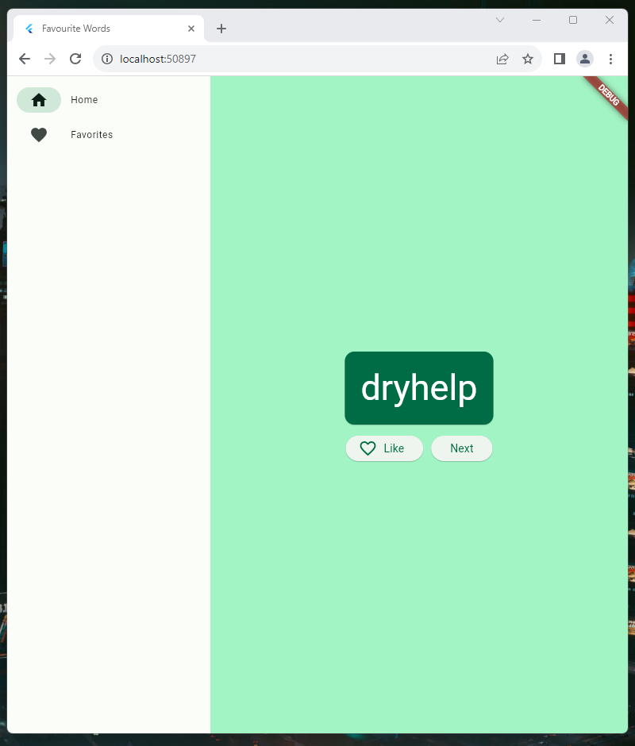
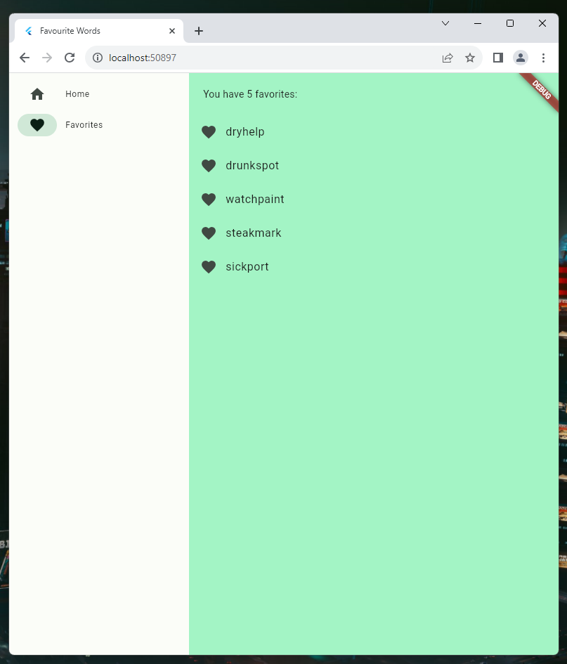

# Flutter

Flutter app that allows the user random words that can be selected as favourites or to see a new word.

## Requirements & Help
### **Flutter**
 - From where to install it: [link of the app Flutter](https://docs.flutter.dev/get-started/install)
 - Video for help: [video of explanation](https://youtu.be/VFDbZk2xhO4?t=119)
### **Visual Studio Code or Visual Studio**
 - From where to install it: [link of the app Visual Studio Code or Visual Studio](https://visualstudio.microsoft.com/es/)
 - Video for help: [video of explanation](https://youtu.be/VFDbZk2xhO4?t=381)
### **Android Studio**
 - From where to install it: [link of the app Android Studio](https://developer.android.com/studio)
 - Video for help: [video of explanation](https://youtu.be/VFDbZk2xhO4?t=543)
   
### How to connect the Flutter code on Virtual Studio Code to our Github repository
The best video I could found about how to doit it's this [video](https://www.youtube.com/watch?v=PiweMDoWhqA).

## Images of the working project
Image of the home of the page where it shows a random word and you have two buttons:
 - **Like** : it keeps all the words that you press the button and you can access to all of the them on the Favouriotes section.
 - **Next** : it shows a random word on the screen everytime you press the button.

It shows all the words you selected as Favorites using the button

## Idea of the project
 - Here is the [Codelab](https://codelabs.developers.google.com/codelabs/flutter-codelab-first?hl=es-419#0)
 - Here is the [explaining video](https://www.youtube.com/watch?v=8sAyPDLorek&t=6s)

## Flutter Info

This project is a starting point for a Flutter application.

A few resources to get you started if this is your first Flutter project:

- [Lab: Write your first Flutter app](https://docs.flutter.dev/get-started/codelab)
- [Cookbook: Useful Flutter samples](https://docs.flutter.dev/cookbook)

For help getting started with Flutter development, view the
[online documentation](https://docs.flutter.dev/), which offers tutorials,
samples, guidance on mobile development, and a full API reference.

## Owner
Hector de la Cruz Baquero - [Linkdedin](https://www.linkedin.com/in/h%C3%A9ctor-de-la-cruz-baquero-ba193429b/) - [Webpage](https://hectorcrzbq.github.io/)
